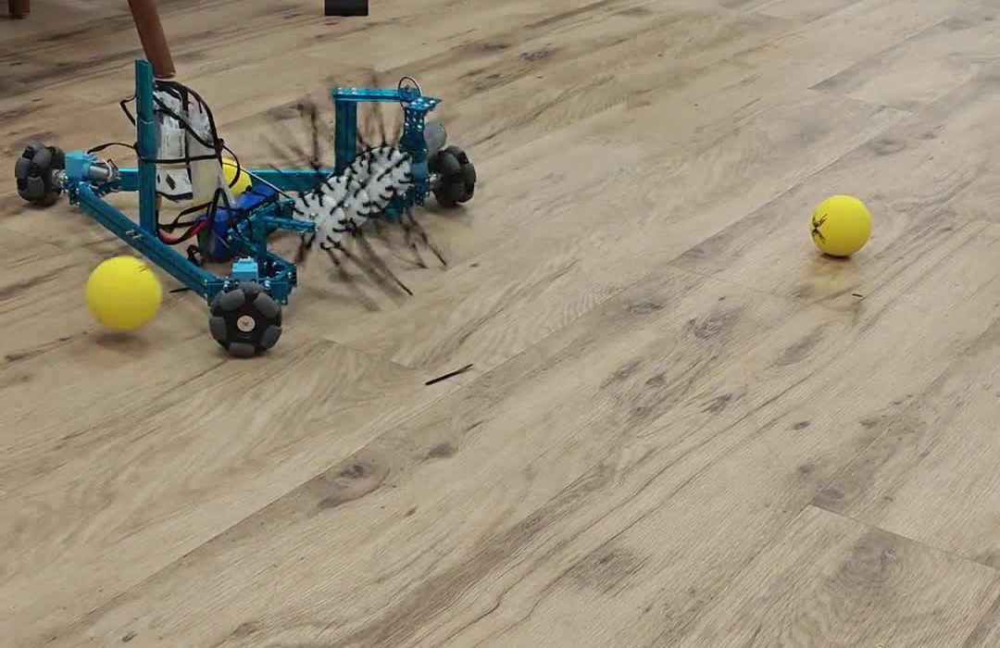
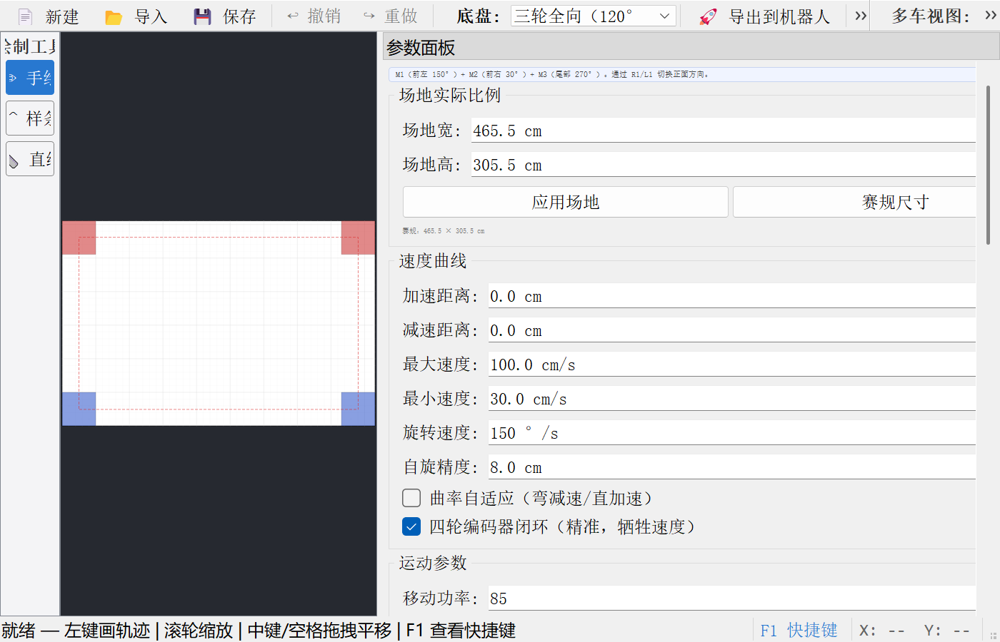
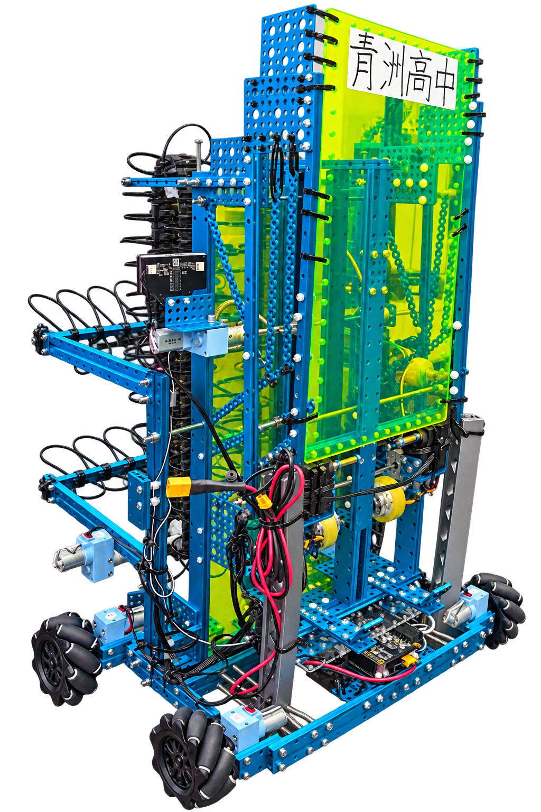
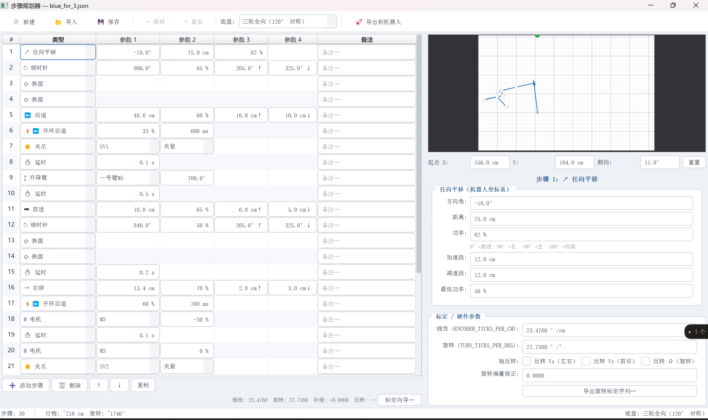
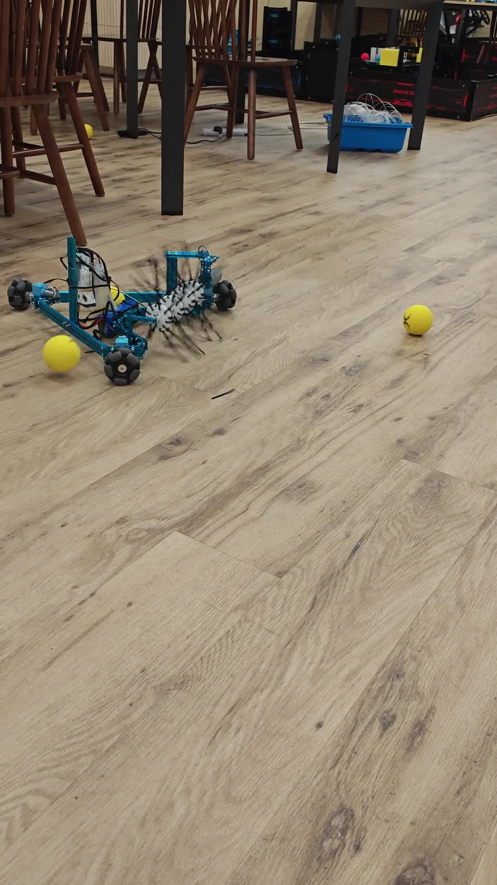
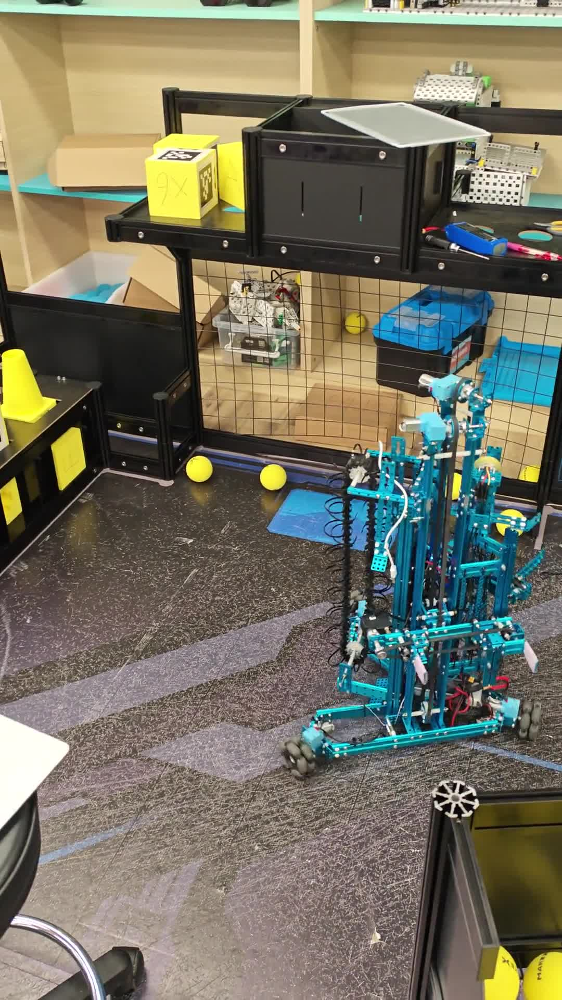

# MakeX 机器人控制与路径规划

本仓库保存三轮全向及四轮麦克纳姆底盘的 Novapi 控制程序、两套桌面规划工具，以及调试记录。现有仓库由莫欣睿维护和整理，开发过程中使用了 AI 辅助工具。项目按实际硬件和赛场任务逐步迭代；仓库中的源码与文档可供阅读，但不能据此认定所有功能都完成了实车验证。

## 项目速览



*三轮全向机器人在室内地面的运行画面，裁切自下方演示视频的预览帧。*

- **做了什么：**围绕三轮全向和四轮麦克纳姆两种底盘，整理机器人端控制程序、轨迹与步骤规划工具及调试文档。
- **怎么查看：**先看本页的实物、界面和演示；需要追溯实现时，从下方入口进入源码和系统说明。
- **验证边界：**照片、视频对应现场片段；桌面规划器可在 Windows 上启动。具体运动参数和完整自动流程仍须按对应硬件逐项复测。

### 一次调试记录

2026 年 7 月曾尝试让升降臂在开机时自动校准，实车出现无响应，方案随后回退。记录保留了当时的三轮修复尝试和排查判断，也说明为什么后续功能要先验证启动，再逐项上车测试。参见[开机自动校准失败记录](docs/lessons-learned/2026-07-07-startup-calibration-failure.md)；文中的原因分析是排查推测，不是已证实的唯一根因。

## 从哪里开始

| 内容 | 入口 | 说明 |
| --- | --- | --- |
| 三轮全向底盘程序 | [`mecanum_forward.py`](mecanum_forward.py) | Novapi 机器人端控制程序，含遥控、自动动作与执行机构逻辑。 |
| 四轮麦克纳姆底盘程序 | [`mecanum_drive.py`](mecanum_drive.py) | Novapi 机器人端控制程序，含四轮运动分配、遥控及自动动作。 |
| 轨迹规划工具 | [`trajectory_planner/`](trajectory_planner/) | PyQt5 桌面界面，可绘制、保存和导出轨迹。 |
| 步骤规划工具 | [`step_planner/`](step_planner/) | PyQt5 桌面界面，以步骤组织机器人动作。 |
| 系统说明 | [`docs/README.md`](docs/README.md) | 坐标系、参数标定、模块索引、操作与检查流程。 |
| 硬件结构与调试 | [`docs/`](docs/) | 物理结构、算法解释、故障排查与分阶段调试记录。 |

## 在电脑上查看规划工具

规划工具需要 Python 和 PyQt5。在仓库根目录运行：

```powershell
python -m pip install PyQt5
python -m trajectory_planner.main
```

步骤规划器的入口为：

```powershell
python -m step_planner.main
```

下图为从当前源码在 Windows 上启动的轨迹规划器界面；它只证明桌面界面可启动，不代表轨迹已在实车完成验证。



机器人端程序依赖 Novapi、mBuild 设备和对应硬件连接，普通电脑上不能直接运行。电机端口、底盘尺寸、编码器比例等参数与具体硬件有关；在真实设备上使用前，需按 [`docs/README.md`](docs/README.md) 和 [`docs/TROUBLESHOOTING.md`](docs/TROUBLESHOOTING.md) 核对接线、标定并逐项测试。不要直接将仓库内的赛场参数套用到其他机器人。

## 实物、界面与演示

下列图片和视频来自本项目桌面资料。照片呈现机器人结构，视频仅展示录制片段中的运行现象；它们不能单独证明仓库所有功能都已完成实车验证。素材未附精确的固件提交号，复现时仍须核对接线与参数。

| 项目素材 | 说明 |
| --- | --- |
| [三轮全向机器人实物图](docs/media/three_wheel_robot.png) | 展示三轮底盘与装置外观。 |
| [三轮底盘运行片段](docs/media/three_wheel_demo_1080p.mp4) | 可见机器人在地面移动及球体；视频是原片压缩版。 |
| [四轮麦克纳姆机器人实物图](docs/media/four_wheel_robot.png) | 展示四轮底盘与装置外观；图片背景经过处理。 |
| [四轮机器人赛场片段](docs/media/four_wheel_field_demo_1080p.mp4) | 可见机器人在 MakeX 场地移动；视频是原片压缩版。 |
| [步骤规划器界面截图](docs/media/step_planner_three_wheel.png) | 显示三轮模式的步骤规划界面。 |

四轮麦克纳姆机器人（实物结构，背景经过处理）：



三轮模式的步骤规划器界面：



三轮底盘运行画面预览：

[](docs/media/three_wheel_demo_1080p.mp4)

四轮机器人赛场画面预览：

[](docs/media/four_wheel_field_demo_1080p.mp4)

三轮与四轮的硬件、软件对应关系见[两车结构讲解](docs/两车结构讲解/README.md)。

## 目前的证据与限制

- 仓库保存了控制程序、规划器源码、轨迹数据与测试文件，可检查实现过程。
- [`docs/lessons-learned/`](docs/lessons-learned/) 分开记录了实车调试问题和静态检查结果；其中明确写为“未经实车”的功能，仍以待验证处理。
- 仓库已收录两种规划工具的界面截图，以及三轮、四轮机器人的实物图和运行片段。视频是局部演示，尚缺按具体程序版本整理的完整实测记录；进一步对应仍应补机器人型号、程序版本和测试日期。
- 这是持续迭代中的项目。历史备份、测试样本和赛场文件保留作过程记录，不宜把文件数量解读为已完成的功能数量。

## 文档

建议先读 [`docs/README.md`](docs/README.md)，再根据需要查看 [`docs/mecanum_drive_算法详解.md`](docs/mecanum_drive_算法详解.md)、[`docs/EXTENDING_FOR_NEW_CHASSIS.md`](docs/EXTENDING_FOR_NEW_CHASSIS.md) 和 [`docs/lessons-learned/`](docs/lessons-learned/)。
